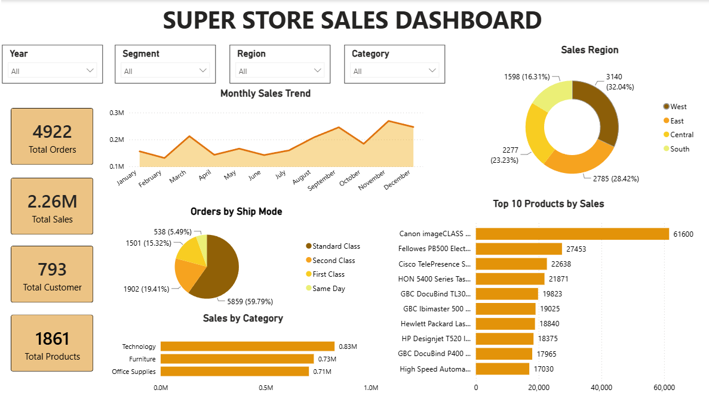

# 📊 SuperStore Sales Dashboard

## 📌 Project Overview

This project presents an interactive **Power BI Sales Dashboard** built using the SuperStore dataset. The dashboard provides insights into sales performance, profit, customers, products, and regional trends through interactive visualizations.

---

## 🎯 Objectives

- Analyze overall sales and profit performance.
- Identify top-performing products and customers.
- Compare sales across different regions and states.
- Track monthly sales trends.
- Create an interactive dashboard for business decision-making.

---

## 🛠️ Tools & Technologies

- Microsoft Power BI
- Power Query
- DAX (Data Analysis Expressions)
- Microsoft Excel

---

## 📊 Dashboard Features

- 📈 Total Sales
- 💰 Total Profit
- 📦 Total Orders
- 📅 Monthly Sales Trend
- 📊 Sales by Category
- 📊 Sales by Sub-Category
- 🌍 Sales by Region
- 🗺️ Sales by State
- 🏆 Top 10 Products
- 👥 Top 10 Customers
- 🍩 Segment-wise Sales
- 🚚 Ship Mode Distribution
- 🎛️ Interactive Slicers

---

## 📁 Dataset

The dashboard is built using the SuperStore sales dataset containing:

- Order ID
- Customer Name
- Product Name
- Category
- Sub-Category
- Sales
- Profit
- Quantity
- Discount
- Region
- State
- Ship Mode
- Order Date

---

## 💡 Key Insights

- Identified top-performing products based on sales.
- Compared sales and profit across different regions.
- Analyzed monthly sales trends.
- Identified high-value customers.
- Created an interactive dashboard for business analysis.

---

## 🖼️ Dashboard Preview

---

## 💼 Skills Demonstrated

- Data Cleaning
- Data Transformation
- Data Visualization
- Dashboard Design
- Business Intelligence
- Power BI
- Power Query
- DAX

---

## 👨‍💻 Author

**Robert Kelwin C**

- LinkedIn: https://linkedin.com/in/robert-kelwin-c
- GitHub: https://github.com/robertkelvinchiristhuraj-oss
